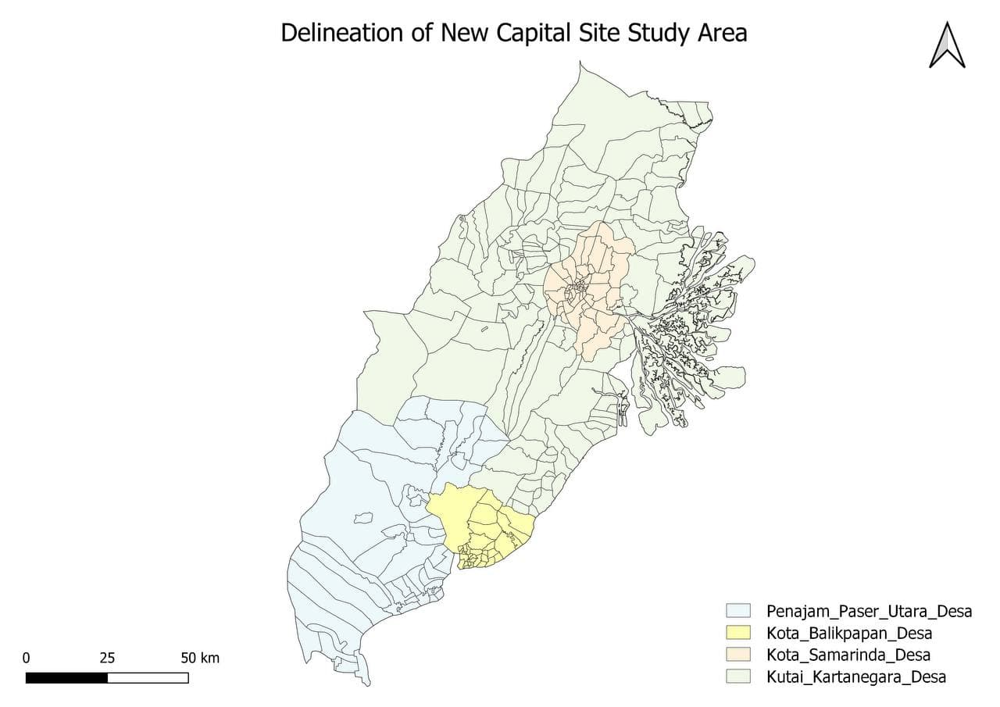

```{r setup, include=FALSE}
knitr::opts_chunk$set(echo = FALSE)
```

# Introduction

In 2019, during his annual state of the union address at the parliament, President Joko Widodo announced a plan to relocate the capital to Kalimantan on the island of Borneo. As part of the plan, part of Kutai Kartanegara Regency (Kabupaten Kutai Kartanegara) and Penajam North Paser Regency (Kabupaten Penajam Utara) in East Kalimantan will be carved out to create a new province-level planned city, and the capital will be relocated to a more central location within Indonesia. This relocation plan is pushed on an urgency, citing Jakarta’s chronic traffic, and sinking foundations. It is also part of the government’s strategy to re-balance the already congested Java island and reduce developmental inequality between Java and other islands in the Indonesian archipelago and to reduce Jakarta’s burden as Indonesia’s primary hub.  

## Project Motivation

This project’s research topic is to analyse and evaluate the proposed Indonesia New National Capital Development Plan. Our methodology includes developing a GIS-Enabled Urban Planning Support System, integrating open government data and other open-source data sets to identify spatial patterns, and analysing the site suitability of the proposed new capital area. We will also identify appropriate areas within study site to set up this new capital development project.  

The study area for this project covers all sub-districts and district of Kota Balikpapan and Kota Samarinda, and selected districts and sub-districts of Kutai Kartanegara and North Penajam Paser Regencies. 

# Study Area



# Site Survey

## Population and Demographic

Almost all sub-districts with highest population quantile are located in Balikpapan Regency and Samarinda Regency. Other two regencies have relatively lower population compared to these two. Hence, we can consider that Kota Balikpapan and Kota Samarinda has the biggest community settlement.  Majority of the sub-districts in Penajam Paser Utara are found to have the least share of population among four regencies. Sub-districts in Kutai Kartanegara have moderate to low population density. Hence, we concluded that the regencies of Penajam Paser Utara and Kutai Kartanegara will be fit for building a new national capital and a community settlement to redistribute the population more fairly across the island.  

Economy and Businesses

In Indonesia, the economy is accounted with the Industrial, Mining and Agriculture. It was stated that the industrial sector account for up to about 40% of GDP in 2015 which includes natural gas, textiles, apparel, and significantly mining. Whereas, the Agriculture sector is accounted for about 14% and Balikpapan city have higher number of manufacturing/mining industrial sector in their economy as compared to the other district. With Indonesia earning the name of the world’s largest palm oil producer in the world, we can infer that Indonesia has the largest plantation area forming the concentration of agriculture's activities in the area. Food crops are cultivated in sawah (wetland), Tegalan and ladang(dryland/garden). Sawah is a flat lowland on downhill sites or floodplains and terraced land on upper slopes. On the other hand, Tegalan  is a gentle slope land and usually has no access to any irrigation system and located close to settlement and ladang, a slope land of different variations of steepness and altitude. 

Transport and Communication

Infrastructure

Environment and Hazards

# Site Selection


Try `posterdown` out! Hopefully you like it!

```{r, include=FALSE}
knitr::write_bib(c('knitr','rmarkdown','posterdown','pagedown'), 'packages.bib')
```

# Conclusion
