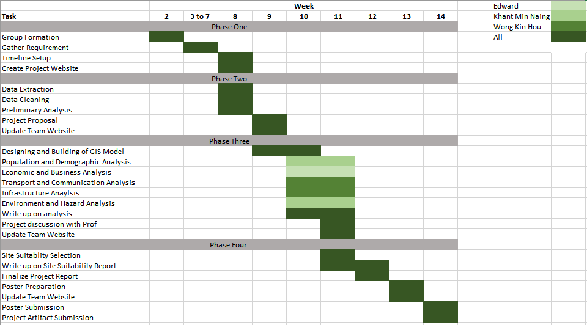

```{r setup, include=FALSE}
knitr::opts_chunk$set(echo = FALSE)

# Learn more about creating websites with Distill at:
# https://rstudio.github.io/distill/website.html

```

## Background
In 2019, during his annual state of the union address at the parliament, President 
Joko Widodo announced a plan to relocate the capital to Kalimantan on the island of 
Borneo. As part of the plan, part of **Kutai Kartanegara Regency** (Kabupaten Kutai 
Kartanegara) and **Penajam North Paser Regency** (Kabupaten Penajam Utara) in 
**East Kalimantan** will be carved out to create a new province-level planned city, and 
the capital will be relocated to a more central location within Indonesia. This 
relocation plan is pushed on an urgency, citing Jakarta's chronic traffic and sinking 
foundations, as well as the need to spur economic activities and growth in the 
eastern half of Indonesia. 

Developed as a final project for **SMT201: Geographic Information Systems** for 
**Urban Planning module**, this project will build up a GIS for the proposed Indonesia 
New National Capital Development Plan and apply GIS analysis and multi-criteria 
evaluation method to identify site suitability for the new capital city.

## Motivation
This project is intended as a hands-on application of our skillsets in data collection, 
processing, and analysing spatially related issues, which were learned in **SMT201: 
Geographic Information Systems for Urban Planning** module.

This project's research topic is to analyse and evaluate the proposed Indonesia New 
National Capital Development Plan. Our methodologies include developing a GIS-Enabled Urban Planning Support System, integrating open government data and 
other open source data sets to identify spatial patterns, and analysing the site 
suitability of the proposed new capital area.

The study area for this project covers all sub-districts and district of Kota Balipapan, 
Kota Samarinda, and selected districts and sub-districts of North Penajam Paser and 
Kutai Kartanegara Regencies.

The plan is part of a strategy to reduce developmental inequality between Java and 
other islands in the Indonesian archipelago and to reduce Jakarta’s burden as 
Indonesia’s primary hub

## Objective
Our project is comprised of two sections.

**(1) Report of Survey Indonesia New National Capital Development Plan**

We will build up a GIS-enabled model and survey report on the study area in 
Kalimantan Timur through in-depth analysis of these aspects.

• Population and Demographic

• Economic and Businesses

• Transport and Communication

• Infrastructure

• Environment and Hazard

**(2) Site Selection for New Capital**

We will carry out multi-criteria suitability evaluation to identify site suitability for the 
proposed new capital city by using the criteria below:

- It should be between 4500-5500 hectares in size
- It should avoid steep slope. Steep slope developments are relative more
costly because they involve cut-and-fill and is less environmental friendly.
- It should be away from potential natural disaster risk areas such as sea 
coasts, major rivers and volcanoes.
- It should be near to current urban settlement areas but not at the current 
major settlement areas.
- It should avoid natural forest as much as possible.
- It should avoid areas prone to forest fire.
- It should be highly accessible via road transport.
- It should be near to airport(s) and seaport(s)

## Data Source

|Data Source|Name|Description|Link|
|----------:|----------:|----------:|----------:|
Indonesia Geospatial|	BATAS DESA DESEMBER 2019 DUKCAPIL KALIMANTAN TIMUR|	Village boundary and population data for East Kalimantan 2019|	https://www.indonesia-geospasial.com/2020/04/download-shapefile-shp-batas-desa.html
Indonesia Geospatial|	Geology Kalimantan Timur|	Geology Shapefile of East Kalimantan|	https://www.indonesia-geospasial.com/2020/03/download-data-shapefile-shp-geologi-se.html
Indonesia Geospatial|	KOTA BALIKPAPAN|	Topographical data layers of Balikpapan City|	https://www.indonesia-geospasial.com/2020/01/shp-rbi-provinsi-kalimantan-timur.html
Indonesia Geospatial|	KOTA SAMARINDA|	Topographical data layers of Samarinda City|	https://www.indonesia-geospasial.com/2020/01/shp-rbi-provinsi-kalimantan-timur.html
Indonesia Geospatial|	KUTAI KARTANEGARA|	Topographical data layers of Kutai Kartanegara Regency|	https://www.indonesia-geospasial.com/2020/01/shp-rbi-provinsi-kalimantan-timur.html
Indonesia Geospatial|	OSM Buildings|	Detailed building footprints throughout Indonesia|	https://www.indonesia-geospasial.com/2020/12/download-shp-pemukiman-detail-seluruh.html
Indonesia Geospatial|	PENAJAM PASER UTARA|	Topographical data layers of Penajam Paser Regency|	https://www.indonesia-geospasial.com/2020/01/shp-rbi-provinsi-kalimantan-timur.html
Indonesia Geospatial|	30. Provinsi Kalimantan Timur|	Digital elevation model at 30m resolution|	https://www.indonesia-geospasial.com/2020/01/download-dem-srtm-30-meter-se-indonesia.html
Indonesia Geospatial|	Titik Api Hotspot se-Indonesia Tahun 2014 - 2019|	Indonesia fire Hotspot data from 2014-2019|	https://www.indonesia-geospasial.com/2020/04/shapefile-shp-titik-api-hotspot.html

## Scope of Work
The project will comprise of, but not limited to the followings steps:

- Selection of project area, this year the project area is provided.
- Data collection, extraction, integration, transformation and wrangling.
- Designing and building GIS model and database
- Preparing report of survey
- Performing site suitability analysis by integrating GIS and multi-criteria 
evaluation methods.
- Preparing site suitability analysis report including detail discussion of the 
analysing method used.
- Preparing poster and project webpage

## Project Schedule


