## Population and Demographics
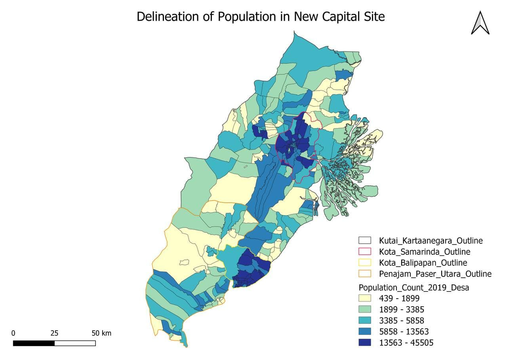
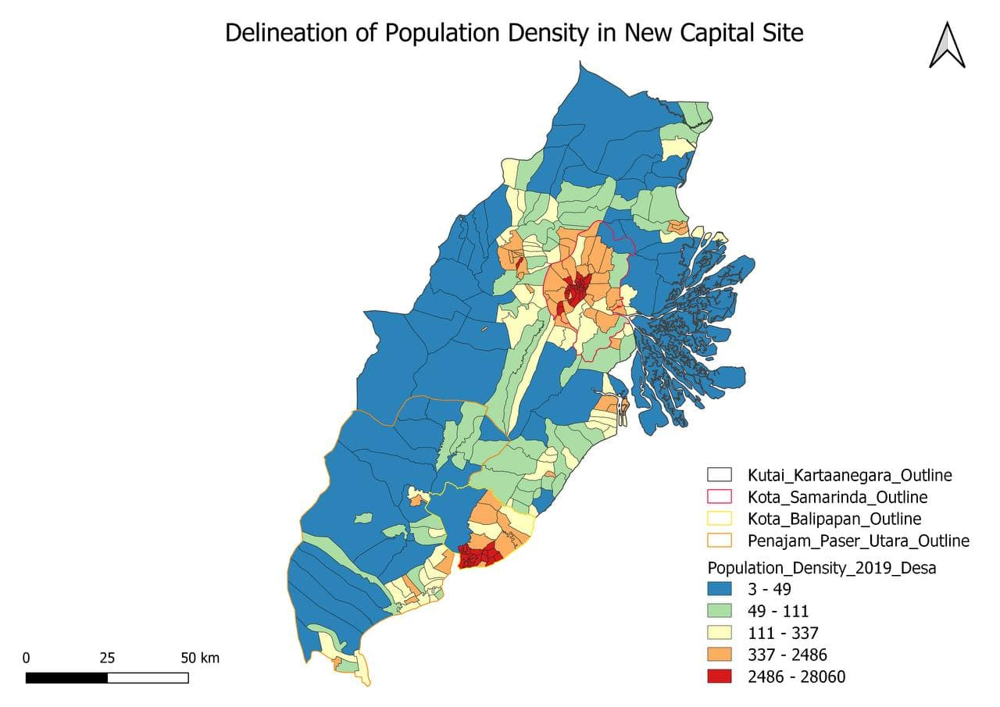
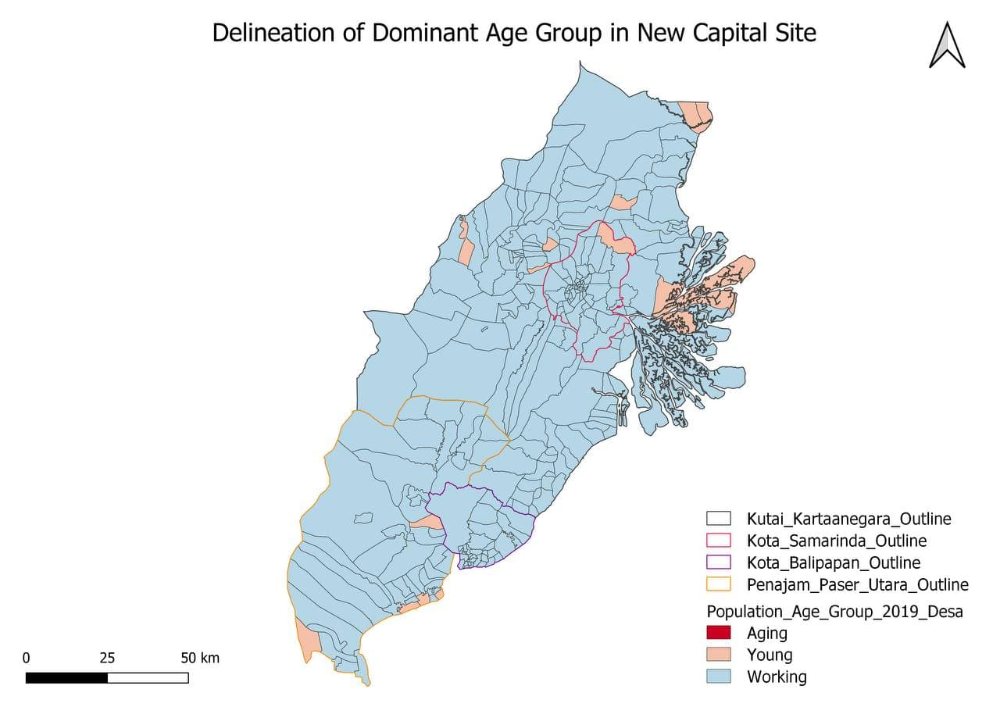

## Economic and Businesses
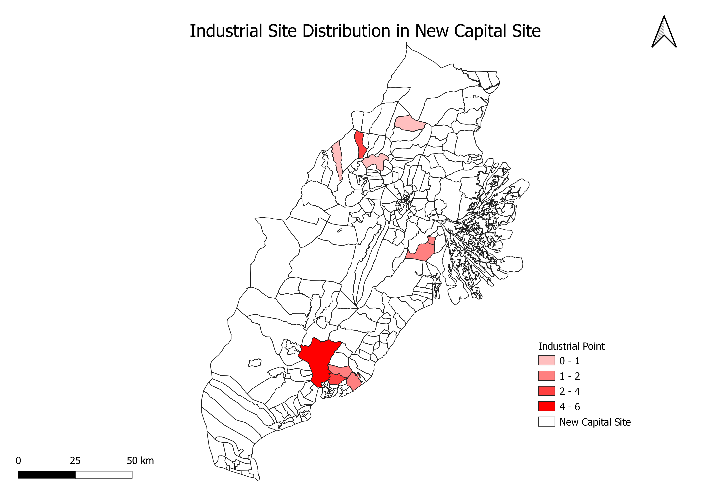
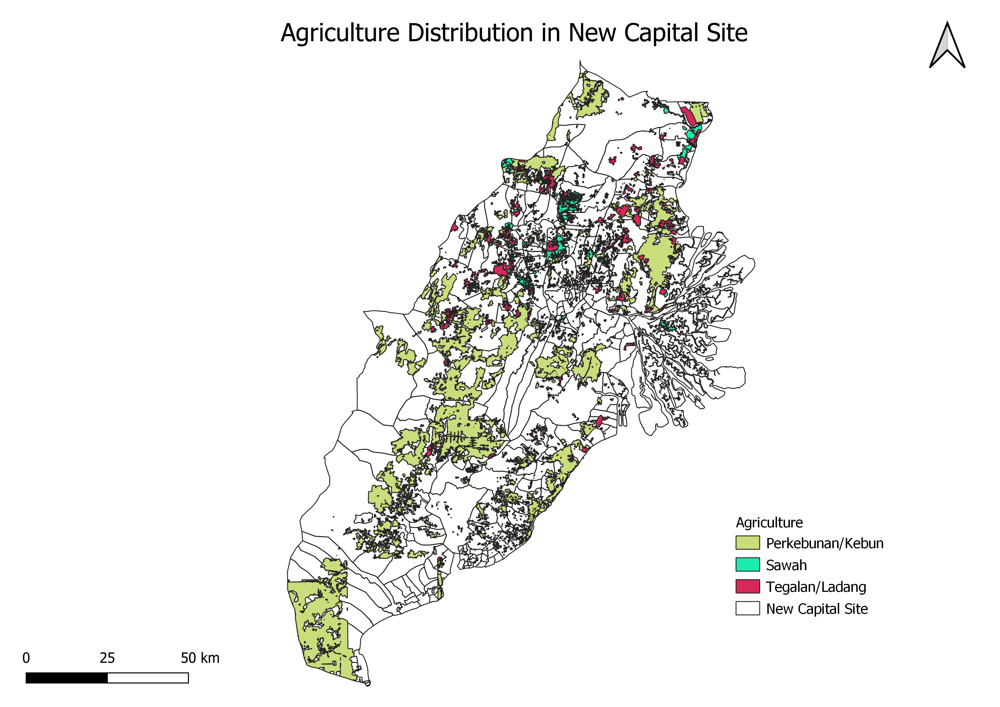


## Transport and Communication

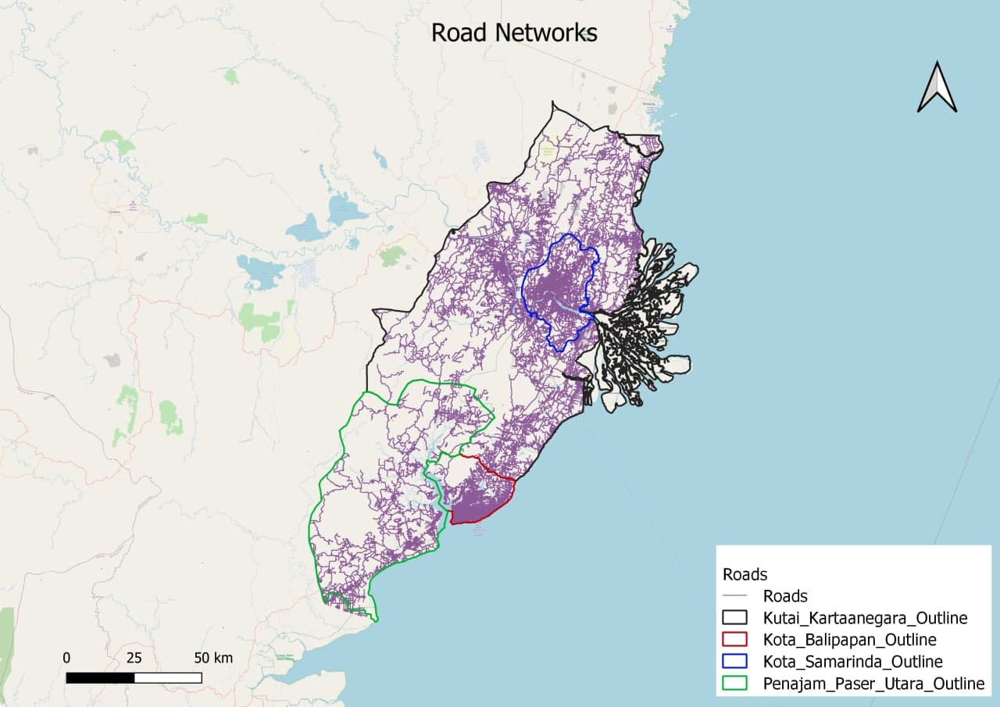
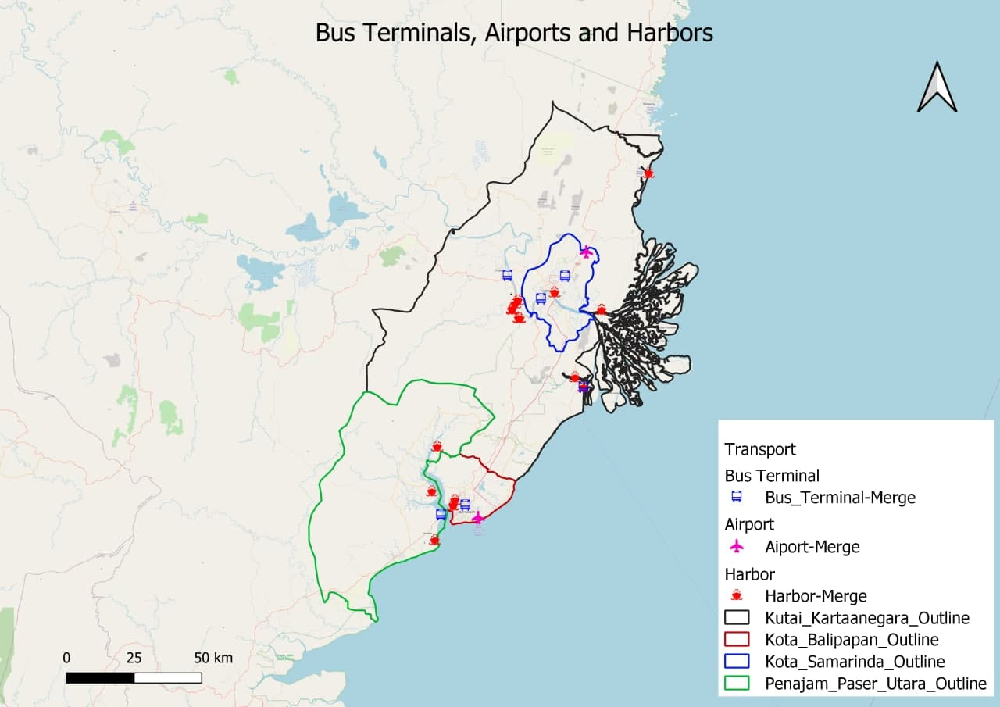
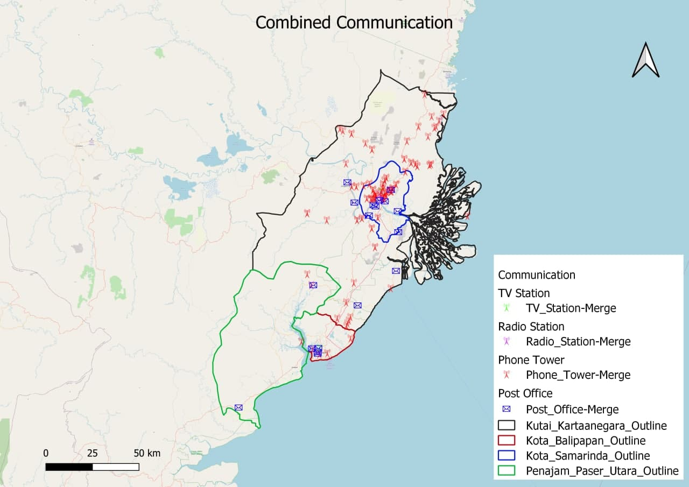


## Infrastructure 
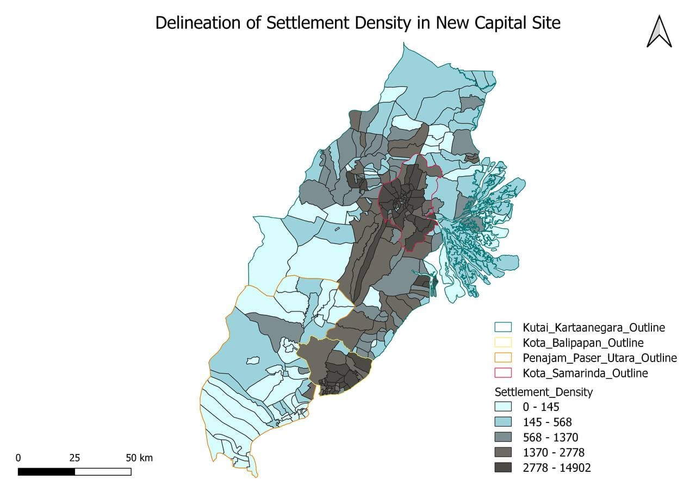


## Environment and Hazard
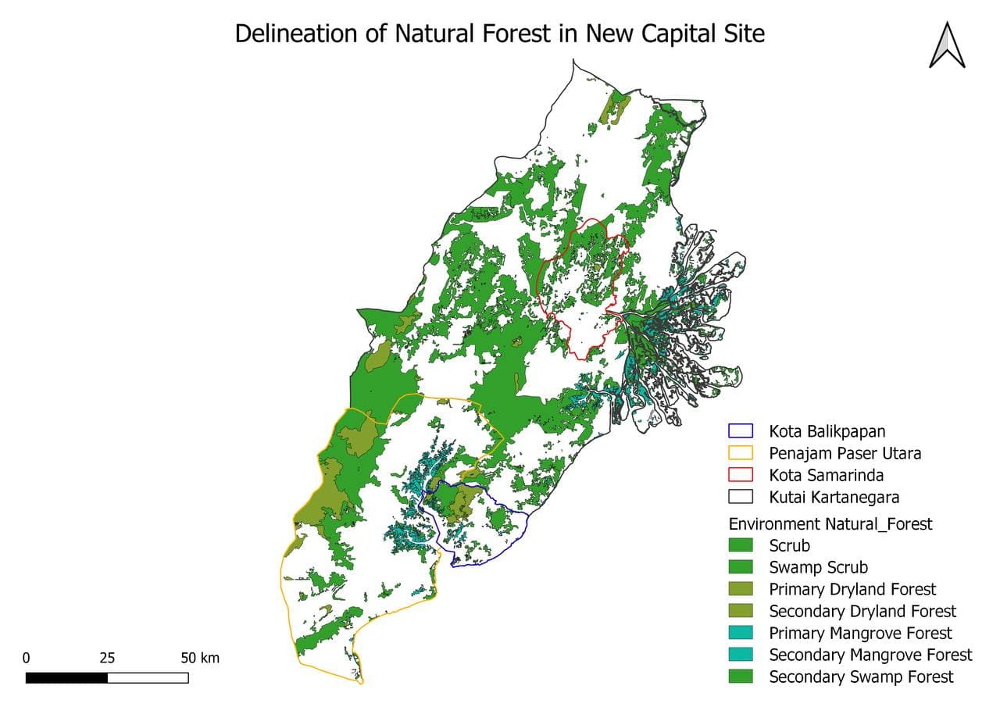
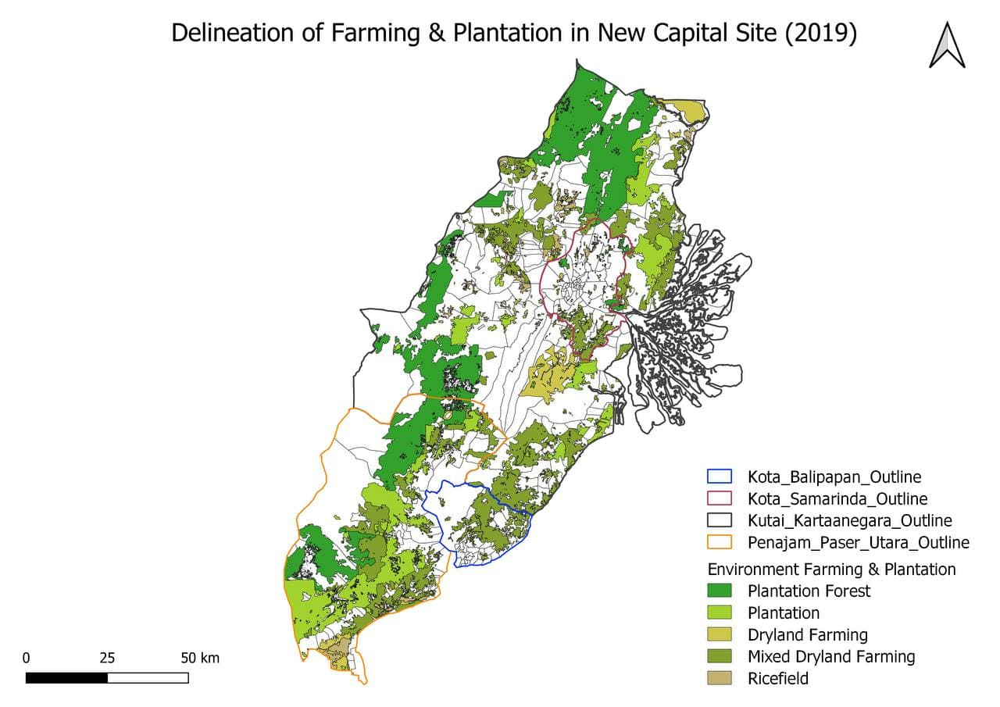
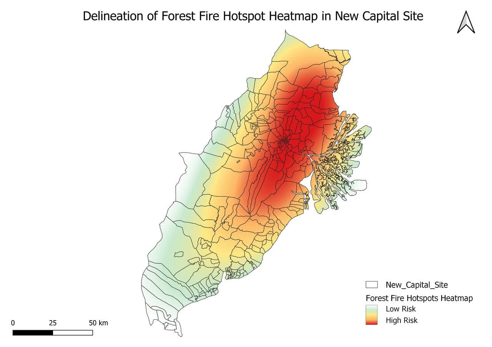


```{r setup, include=FALSE}
knitr::opts_chunk$set(echo = FALSE)

# Learn more about creating websites with Distill at:
# https://rstudio.github.io/distill/website.html

```


