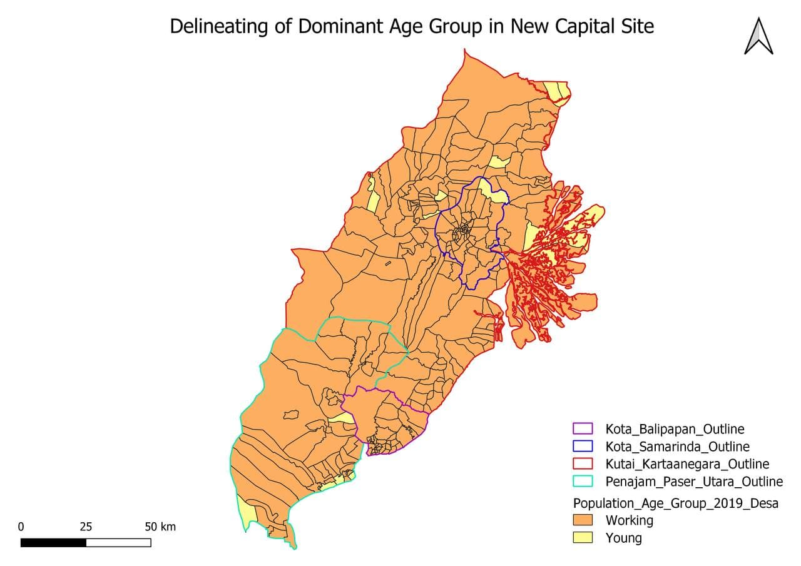

## Population and Demographics

According to Map X.Y., almost all sub-districts with highest population quantile (13563 – 45505) are located in Balikpapan Regency and Samarinda Regency. Other two regencies have relatively lower population compared to these two. Hence, we can consider that Kota Balikpapan and Kota Samarinda has the biggest community settlement.  



According to Map X.Y., the sub-districts with highest population are observed within Kota Balikpapan and Kota Samarinda. Majority of the sub-districts in Penajam Paser Utara are found to have the least share of population among four regencies. Sub-districts in Kutai Kartanegara have moderate to low population density. Hence, we concluded that the regencies of Penajam Paser Utara and Kutai Kartanegara will be fit for building a new national capital and a community settlement to redistribute the population more fairly across the island.  

## Economic and Businesses

In Indonesia, the economy is accounted with the Industrial, Mining and Agriculture. It was stated that the industrial sector account for up to about 40% of GDP in 2015 which includes natural gas, textiles, apparel, and significantly mining. Whereas, the Agriculture sector is accounted for about 14% 

It represents the manufacturing/mining industrial sector found in the study area. From this we can distinctively identify that Balikpapan city have higher number of manufacturing/mining industrial sector in their economy as more of the site are observed here. 

With Indonesia earning the name of the world’s largest palm oil producer in the world, we can infer that Indonesia has the largest plantation area forming the concentration of agriculture's activities in the area. Food crops are cultivated in sawah (wetland),, Tegalan and ladang(dryland/garden). Sawah is a flat lowland on downhill sites or floodplains and terraced land on upper slopes. On the other hand, Tegalan  is a gentle slope land and usually has no access to any irrigation system and located close to settlement and ladang, a slope land of different variations of steepness and altitude. 


## Transport and Communication


## Infrastructure 

From the above settlement choropleth map, it could be identified briefly that there are several distinct urban clusters. Kota Balikpapan is small but extremely dense. Kota Samarinda is also another small district with a dense settlement. Penajamm Paser Ultra on the other hand is significantly less dense than its neighbouring districts. Kutai Kartaanegara is not very dense overall, but contains several clusters of significant settlements. 


Based on the topological dataset, there are 4 main points of electricity. Most of them are near and within the service range of Kota Samarinda. Therefore, Kota Samarinda has the highest accessibility to electricity. Although Kutai Kartaanegara has the greatest number of electricity points, its huge surface area is more underserved than Kota Samarinda. Kota Balikpapan might not have any points of electricity but it has access to the nearest electrical point in Kutai Kartaanegara. Penajam Paser Utara on the other hand does not have any electrical points and has the overall poorest access to electricity. 


## Environment and Hazard

According to Map X.Y., the study area has dominant land-cover of natural forests, which we needed to avoid when implementing the new capital city.  

According to Indonesian National Board for Disaster Management (BNPB), East Kalimantan area is most prone to forest fires, compared to other hazards like volcanic eruptions, earthquakes, tsunamis, floods, and landslides. Moreover, some of the data such as location of volcanoes were not readily available. Hence, for this section, we focused on 1) forest fires and 2) major rivers in our study area.  


```{r setup, include=FALSE}
knitr::opts_chunk$set(echo = FALSE)

# Learn more about creating websites with Distill at:
# https://rstudio.github.io/distill/website.html

```


