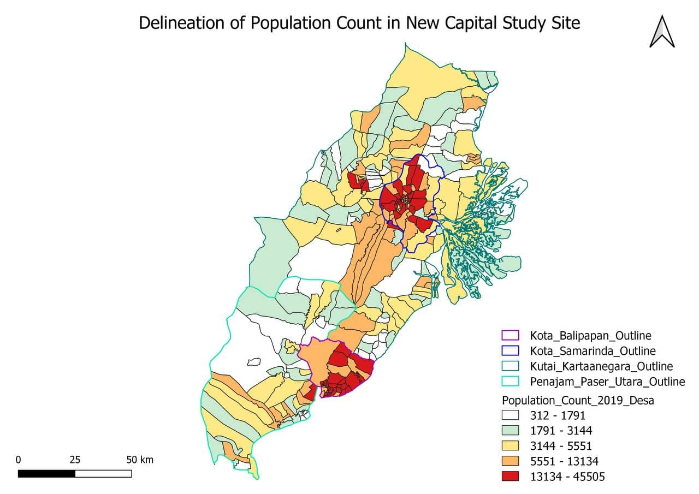

## Population and Demographics



## Economic and Businesses


## Transport and Communication


## Infrastructure 


## Environment and Hazard


```{r setup, include=FALSE}
knitr::opts_chunk$set(echo = FALSE)

# Learn more about creating websites with Distill at:
# https://rstudio.github.io/distill/website.html

```


